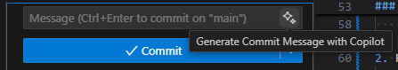

# Task: Implement, Test & Refactor Methods using GitHub Copilot

## Objective

The goal of this task is to familiarize you with the features of GitHub Copilot by setting up a Node.js project, implementing a set of methods in a JavaScript class skeleton, and validating them through unit tests using Mocha and Chai.

## Additional Notes:
- Use GitHub Copilot for assistance at each step.
- Review and understand the generated code.
- Run your tests frequently to validate each implementation task.
- Ensure that all tests pass before completion.

### Note for Participants
This task is helpful for participants with any programming language background since you are not expected to write any code but just utilize GitHub Copilot to go through its features. This exercise is designed to help you explore and get comfortable with what GitHub Copilot can do, regardless of your prior coding experience.

## Table of Contents
- [Setup Environment](#setup-environment)
- [Task 1: Write Code](#task-1-write-code)
- [Task 2: Write Unit Tests](#task-2-write-unit-tests)
- [Task 3: Refactor Code](#task-3-refactor-code)

## Setup Environment
1. Fork the pre-prepared repository https://github.com/VitaliVishneuski/github_copilot_practice_js.git

2. Clone your forked repository on local machine:

    **Terminal Command**:
    ```bash
    git clone [Your Forked Repository URL]
    cd github_copilot_practice_js
    ```

3. Check environment:

    **Terminal Command**:
    ```bash
    npm run test
    ```

    **Valid output**:
    ```
    AdvancedOperations
      1) should return the maximum value in an array
      2) should return the reversed string
      3) should return the formatted date as YYYY-MM-DD
      4) should return the factorial of a number
      ✔ should calculate statistics for a set of numbers
      ✔ should handle an empty array
      ✔ should handle an array with one element
      ✔ should handle negative numbers

    4 passing (25ms)
    4 failing

    ...
    ```   

    **Possible issues and solutions**:
    - `npm` command is not found, it means that you need to install Node.js, visit site https://nodejs.org, download and istall it on your local machine 

## Tasks

### Task 1: Write Code
1. Open [`AdvancedOperations.mjs`](src/AdvancedOperations.mjs) and implement the methods using GitHub Copilot assistance:
    - `findMax`
    - `reverseString`
    - `formatDate`
    - `factorial`

2. Run Unit Tests, make sure that no more tests are failing:

    **Terminal Command**:
    ```bash
    npm run test
    ``` 

3. Use GitHub Copilot to add JSDoc comments for the following methods:
    - `findMax`
    - `reverseString`
    - `formatDate`
    - `factorial`

4. Generate Commit Message with Copilot and commit your changes:

    You can use Source Control component of VS Code:

    

    **OR** follow the instructions for command line:

    - Use `git diff` to get the changes you made, `clip` and `pbcopy` copy the changes to clipboard. 

        **Terminal Commands (Windows)**:
        ```
        git diff | clip
        ```

        **Terminal Commands (MacOS)**:
        ```
        git diff | pbcopy
        ```
 
    - Use GitHub Copilot Chat to generate an appropriate commit message for your changes.

        **Terminal Commands**:
        ```
        git add .
        git commit -m "[Commit message generated by GitHub Copilot]"
        ```

### Task 2: Write Unit Tests

You may consider approaching the task using Test-Driven Development (TDD).

**OR** following the basic flow outlined in the instructions:

1. Open [`AdvancedOperations.mjs`](src/AdvancedOperations.mjs) and implement the methods using GitHub Copilot assistance:
    - `fibonacci`
    - `isPalindrome`
    - `mergeAndSort`

2. Open [`test/test.mjs`](test/test.mjs) and write unit tests for methods above, making sure the coverage is acceptable.

3. Run Unit Tests, make sure that all new tests are not failing:

    **Terminal Command**:
    ```bash
    npm run test
    ``` 

4. Generate Commit Message with Copilot and commit your changes.

    Follow the instructions in [Task 1, Step 4](#task-1-write-code).

### Task 3: Refactor Code
1. Review the `calculateStatistics` method in [`AdvancedOperations.mjs`](src/AdvancedOperations.mjs) that calculates statistics for a set of numbers but utilizes bad practices and violates DRY, KISS, SOLID, and other principles.

2. Use GitHub Copilot to refactor the `calculateStatistics` method to follow DRY, KISS, SOLID, and other principles.

3. Run Unit Tests, make sure that your changes do not break unit tests:

    **Terminal Command**:
    ```bash
    npm run test
    ``` 

4. Generate Commit Message with Copilot and commit your changes.

    Follow the instructions in [Task 1, Step 4](#task-1-write-code).
